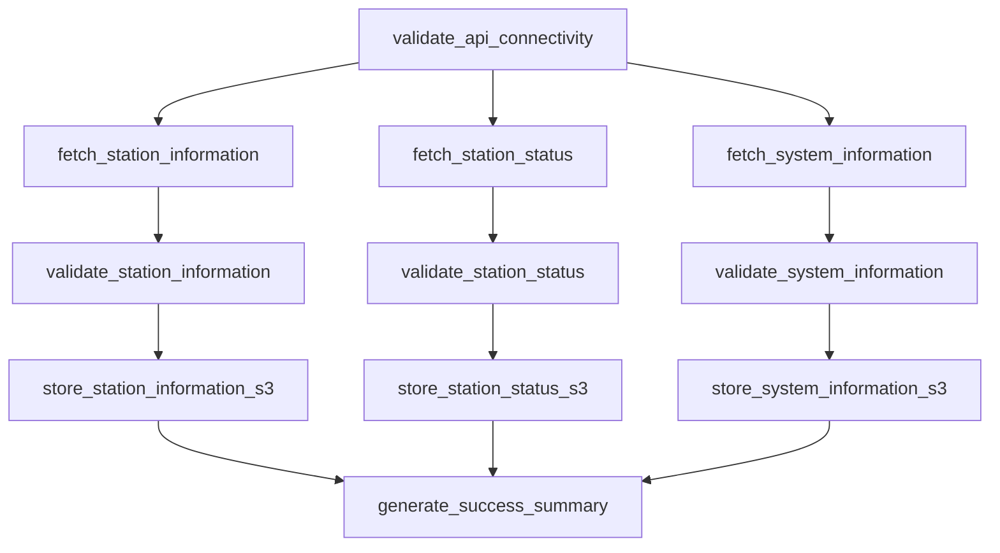

# GBFS Data Ingestion Documentation

Complete guide for GBFS (General Bikeshare Feed Specification) data ingestion using Apache Airflow for the Divvy Bike Share analytics platform.

**Author:** Analytics Engineering Team  
**Created:** July 2025  
**Version:** 1.0

---

## Overview

The GBFS data ingestion system collects real-time and static station data from Divvy's GBFS API endpoints to support operational analytics and business intelligence. This system follows the Bronze layer ingestion pattern, storing raw data in S3 for downstream processing by dbt.

### Key Components

- **Primary DAG:** `gbfs_data_ingestion.py` - Main Airflow workflow
- **Configuration:** `gbfs_scheduled_collection.py` - Scheduling templates and best practices
- **Data Sources:** Lyft GBFS API endpoints for Chicago Divvy system
- **Storage:** AWS S3 Bronze layer with date/hour partitioning

---

## File Structure and Purpose

### 1. `gbfs_data_ingestion.py` - Main DAG File

**Purpose:** Primary Airflow DAG that executes the complete GBFS data collection workflow

**Current Configuration:**
- **Schedule:** Manual trigger (`schedule_interval=None`)
- **Owner:** analytics-team
- **Retries:** 3 attempts with 5-minute delays
- **Catchup:** Disabled for real-time data focus

**Key Features:**
- Fetches data from multiple GBFS endpoints
- Validates API responses and data quality
- Stores raw JSON data in S3 with timestamps
- Implements error handling and retry logic
- Provides comprehensive logging and monitoring

**Usage:** This is the active DAG that runs in Airflow to collect GBFS data

### 2. `gbfs_scheduled_collection.py` - Configuration Reference

**Purpose:** Configuration templates and scheduling recommendations for production deployment

**Contents:**
- Recommended schedule intervals for different endpoints
- Default DAG arguments for scheduled collections
- Best practice configurations for automated runs

**Usage:** Reference file to guide production scheduling implementation

**Key Schedules Defined:**
- **Station Information:** Daily at 6:00 AM (`0 6 * * *`)
- **Station Status:** Every 2 hours (`0 */2 * * *`)
- **System Information:** Daily at noon (`0 12 * * *`)

---

## Data Sources and Endpoints

### GBFS API Base URL
```
https://gbfs.lyft.com/gbfs/2.3/chi/en/
```

### Supported Endpoints

#### 1. Station Information (`station_information.json`)
- **Type:** Static metadata
- **Update Frequency:** Daily
- **Content:** Station locations, capacity, names, amenities
- **Recommended Schedule:** Daily at 6:00 AM
- **TTL:** Not applicable (static data)

#### 2. Station Status (`station_status.json`)
- **Type:** Real-time availability data
- **Update Frequency:** Every 60 seconds (API TTL)
- **Content:** Available bikes/docks, operational status
- **Recommended Schedule:** Every 2 hours for trend analysis
- **TTL:** 60 seconds

#### 3. System Information (`system_information.json`)
- **Type:** System metadata
- **Update Frequency:** Infrequent updates
- **Content:** System name, operator, timezone, language
- **Recommended Schedule:** Daily at noon
- **TTL:** Not applicable

#### 4. Free Bike Status (`free_bike_status.json`)
- **Type:** Dockless bike locations
- **Update Frequency:** Real-time
- **Content:** Individual bike locations and status
- **Recommended Schedule:** Every 30 minutes (if needed)
- **TTL:** 60 seconds

---

## Data Flow Architecture

### Bronze Layer Storage Pattern

```
s3://divvybikes-dev-bronze-96wb3c9c/gbfs-data/
├── station_information/
│   └── year=2025/month=07/day=27/
│       └── station_information_2025-07-27_06-00-00.json
├── station_status/
│   └── year=2025/month=07/day=27/hour=14/
│       └── station_status_2025-07-27_14-00-00.json
└── system_information/
    └── year=2025/month=07/day=27/
        └── system_information_2025-07-27_12-00-00.json
```

### File Naming Convention

```
{endpoint_name}_{YYYY-MM-DD}_{HH-MM-SS}.json
```

**Examples:**
- `station_information_2025-07-27_06-00-00.json`
- `station_status_2025-07-27_14-00-00.json`
- `system_information_2025-07-27_12-00-00.json`

### Partitioning Strategy

#### Station Information (Daily Partitions)
```
year=YYYY/month=MM/day=DD/
```

#### Station Status (Hourly Partitions)
```
year=YYYY/month=MM/day=DD/hour=HH/
```

**Rationale:** Balance query performance with storage costs based on update frequency

---

## Implementation Modes

### Development Mode (Current)

**Configuration:**
```python
schedule_interval=None  # Manual trigger only
```

**Usage:**
1. Test DAG functionality in Airflow UI
2. Validate API connections and data quality
3. Verify S3 storage and partitioning
4. Run ad-hoc data collection as needed

**Advantages:**
- Safe for testing and development
- Full control over execution timing
- Easy debugging and validation
- No risk of overwhelming API endpoints

### Production Mode (Future)

**Configuration:**
```python
# Station Information - Daily collection
schedule_interval="0 6 * * *"  # 6:00 AM daily

# Station Status - Bi-hourly collection  
schedule_interval="0 */2 * * *"  # Every 2 hours

# System Information - Daily collection
schedule_interval="0 12 * * *"  # 12:00 PM daily
```

**Implementation Steps:**
1. Modify `gbfs_data_ingestion.py` to use desired schedule
2. Test scheduled execution in development environment
3. Deploy to production Airflow instance
4. Monitor automated runs and data quality

---

## DAG Tasks and Workflow

### Task Dependencies



### Task Descriptions

#### 1. `validate_api_connectivity`
- **Purpose:** Test GBFS API base URL accessibility
- **Function:** Validates API endpoint availability before data collection
- **Failure Action:** Stops DAG execution if API is unreachable

#### 2. `fetch_{endpoint_name}`
- **Purpose:** Retrieve data from specific GBFS endpoints
- **Function:** Makes HTTP requests and captures complete API responses
- **Error Handling:** Retries on transient failures, logs detailed errors

#### 3. `validate_{endpoint_name}`
- **Purpose:** Validate data quality and structure
- **Function:** Checks required fields, data types, and business rules
- **Quality Checks:**
  - JSON structure validation
  - Required field presence
  - Data type consistency
  - Coordinate bounds validation (Chicago area)

#### 4. `store_{endpoint_name}_s3`
- **Purpose:** Store validated data in S3 Bronze layer
- **Function:** Uploads JSON files with proper partitioning and metadata
- **Metadata Added:**
  - Fetch timestamp
  - Data validation status
  - Record counts
  - File size and compression info

#### 5. `generate_success_summary`
- **Purpose:** Create execution summary and metrics
- **Function:** Aggregates results from all collection tasks
- **Output:** Summary report for monitoring and alerting

---

## Configuration and Variables

### Airflow Variables Required

| Variable Name | Purpose | Example Value |
|--------------|---------|---------------|
| `aws_s3_bucket_bronze` | S3 bucket for Bronze layer | `divvybikes-dev-bronze-96wb3c9c` |
| `gbfs_api_timeout` | API request timeout | `30` |
| `gbfs_max_retries` | Maximum API retries | `3` |
| `gbfs_retry_delay` | Delay between retries | `5` |

### S3 Configuration

```python
S3_BUCKET = Variable.get("aws_s3_bucket_bronze")
S3_KEY_PREFIX = "gbfs-data"
```

### API Configuration

```python
GBFS_BASE_URL = "https://gbfs.lyft.com/gbfs/2.3/chi/en"
REQUEST_TIMEOUT = int(Variable.get("gbfs_api_timeout", 30))
MAX_RETRIES = int(Variable.get("gbfs_max_retries", 3))
```

---

## Data Quality and Validation

### Validation Rules

#### Station Information
- Station ID must be unique and non-null
- Coordinates must be within Chicago/Evanston bounds
- Capacity must be positive integer
- Station name must be non-empty string

#### Station Status
- All count fields must be non-negative integers
- Station ID must exist in station information
- Operational flags must be boolean
- Total capacity should be reasonable

#### System Information
- System ID and name must be present
- Timezone must be valid
- Language codes must follow ISO standards

### Error Handling

#### API Failures
1. **Connection Errors:** Retry with exponential backoff
2. **HTTP Errors:** Log status codes and response content
3. **Timeout Errors:** Increase timeout for subsequent retries
4. **Rate Limiting:** Implement delays to respect API limits

#### Data Quality Issues
1. **Missing Required Fields:** Log specific field names and continue
2. **Invalid Data Types:** Convert when possible, flag when not
3. **Coordinate Validation:** Flag stations outside expected bounds
4. **Capacity Inconsistencies:** Log warnings for review

---

## Monitoring and Alerting

### Key Metrics to Monitor

#### Operational Metrics
- DAG success/failure rate
- Task execution duration
- API response times
- Data volume collected per run

#### Data Quality Metrics
- Validation failure percentage
- Missing data counts
- Coordinate validation failures
- Capacity consistency issues

#### Business Metrics
- Total stations tracked
- Active vs inactive stations
- System availability percentage
- Data freshness (time since last update)

### Alerting Thresholds

#### Critical Alerts
- DAG failure rate > 10%
- API unavailable for > 15 minutes
- Data quality score < 90%
- Zero records collected in scheduled run

#### Warning Alerts
- API response time > 10 seconds
- Data quality score 90-95%
- Missing expected number of stations
- Validation warnings increasing

---

## Migration from Manual to Scheduled

### Phase 1: Manual Testing (Current)
1. ✅ Validate DAG execution in Airflow UI
2. ✅ Test API connectivity and data collection
3. ✅ Verify S3 storage and partitioning
4. ✅ Confirm data quality validation

### Phase 2: Scheduled Implementation (Future)

#### Step 1: Update DAG Configuration
```python
# Replace in gbfs_data_ingestion.py
schedule_interval="0 */2 * * *"  # Every 2 hours for station status
```

#### Step 2: Configure Separate DAGs (Recommended)
Create separate DAGs for different collection frequencies:

**Daily Collection DAG:**
- Station Information
- System Information
- Schedule: `0 6 * * *`

**Hourly Collection DAG:**
- Station Status
- Schedule: `0 */2 * * *`

#### Step 3: Production Deployment
1. Test scheduled execution in staging environment
2. Monitor resource usage and API impact
3. Deploy to production with gradual rollout
4. Implement comprehensive monitoring

### Phase 3: Optimization (Future)
1. Implement intelligent scheduling based on data freshness
2. Add data quality trend analysis
3. Optimize partitioning strategy based on query patterns
4. Implement automated alerting and remediation

---

## Integration with dbt

### Data Handoff to Silver Layer

The GBFS ingestion system provides Bronze layer data that serves as input for dbt staging models:

```
Bronze (Airflow) → Silver (dbt) → Gold (dbt)
```

#### dbt Model Integration
- **Input:** Raw JSON files in S3 Bronze layer
- **Processing:** dbt staging models (`stg_gbfs__*`)
- **Output:** Clean, validated tables in Silver layer

#### File References for dbt
- **Models:** `dbt/models/staging/stg_gbfs__station_information.sql`
- **Models:** `dbt/models/staging/stg_gbfs__station_status.sql`
- **Documentation:** `dbt/README.md`

---

## Troubleshooting Guide

### Common Issues and Solutions

#### 1. API Connection Failures
**Symptoms:** DAG fails at `validate_api_connectivity` task
**Causes:** Network issues, API downtime, firewall restrictions
**Solutions:**
- Check Airflow worker internet connectivity
- Verify GBFS API status at base URL
- Review proxy/firewall configurations
- Increase timeout values if needed

#### 2. S3 Upload Failures
**Symptoms:** Tasks fail at `store_{endpoint}_s3` steps
**Causes:** AWS credentials, bucket permissions, network issues
**Solutions:**
- Verify AWS connection in Airflow
- Check S3 bucket permissions and policies
- Validate IAM role assignments
- Review CloudWatch logs for detailed errors

#### 3. Data Quality Validation Failures
**Symptoms:** High number of validation warnings/errors
**Causes:** API schema changes, data corruption, new stations
**Solutions:**
- Review validation error details in logs
- Compare current data structure with expected schema
- Update validation rules if API schema changed
- Investigate data source for systematic issues

#### 4. Schedule Execution Issues
**Symptoms:** DAG not running at expected times
**Causes:** Scheduler configuration, timezone issues, resource constraints
**Solutions:**
- Verify Airflow scheduler is running
- Check timezone settings in DAG and Airflow
- Review resource usage and worker availability
- Validate cron expression syntax

### Debugging Steps

#### 1. Check DAG Status
```bash
# View DAG status
airflow dags state gbfs_data_ingestion

# Check task instances
airflow tasks states-for-dag-run gbfs_data_ingestion <execution_date>
```

#### 2. Review Logs
```bash
# View task logs
airflow tasks log gbfs_data_ingestion fetch_station_status <execution_date>

# Check scheduler logs
tail -f $AIRFLOW_HOME/logs/scheduler/latest/*.log
```

#### 3. Test API Connectivity
```bash
# Test GBFS API endpoint
curl -I https://gbfs.lyft.com/gbfs/2.3/chi/en/station_information.json

# Check response time
curl -w "@curl-format.txt" -o /dev/null -s https://gbfs.lyft.com/gbfs/2.3/chi/en/station_status.json
```

#### 4. Validate S3 Access
```bash
# List S3 bucket contents
aws s3 ls s3://divvybikes-dev-bronze-96wb3c9c/gbfs-data/

# Check recent uploads
aws s3 ls s3://divvybikes-dev-bronze-96wb3c9c/gbfs-data/station_status/ --recursive | tail -10
```

---

## Performance Optimization

### API Request Optimization
- Implement request pooling for concurrent endpoint fetching
- Add caching for duplicate requests within execution window
- Use compression for large responses
- Implement circuit breaker pattern for API failures

### Storage Optimization
- Use S3 multipart uploads for large files
- Implement file compression (gzip) for storage efficiency
- Optimize partition structure based on query patterns
- Set appropriate S3 storage classes for cost optimization

### Resource Management
- Configure appropriate worker resources for DAG
- Implement task concurrency limits to prevent overwhelming API
- Use smart retries with jitter to handle transient failures
- Monitor and optimize memory usage for large JSON processing

---

## Security Considerations

### API Security
- No authentication required for public GBFS endpoints
- Implement rate limiting to respect API terms of service
- Use HTTPS for all API communications
- Log API interactions for audit purposes

### Data Security
- Encrypt data in transit and at rest in S3
- Use IAM roles with principle of least privilege
- Implement S3 bucket policies for access control
- Enable CloudTrail logging for audit compliance

### Access Control
- Restrict Airflow DAG access to authorized users
- Use environment-specific credentials
- Implement secure variable storage in Airflow
- Regular rotation of AWS access keys

---

## Summary

The GBFS data ingestion system provides a robust foundation for collecting Divvy bike share station data. Key benefits include:

- **Flexibility:** Support for both manual and automated execution
- **Reliability:** Comprehensive error handling and retry logic
- **Scalability:** Efficient partitioning and storage strategy
- **Maintainability:** Clear separation of concerns and documentation
- **Integration:** Seamless handoff to dbt for downstream processing

The current manual execution mode allows for thorough testing and validation, while the configuration framework supports easy migration to automated scheduling when ready for production deployment.

For implementation details of downstream processing, refer to:
- `docs/gbfs_data_lineage.md` - Complete data flow documentation
- `dbt/README.md` - dbt model specifications and implementation guide
