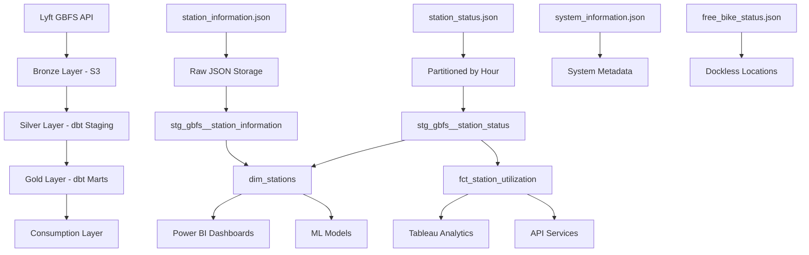

# GBFS Data Lineage and Architecture Documentation

Complete documentation of GBFS data flow, transformations, and integration
for the Divvy Bike Share analytics platform using dbt-centric ELT architecture.

**Author:** Analytics Engineering Team  
**Created:** July 2025  
**Version:** 1.0

## Architecture Overview

- **Bronze Layer:** Python/Airflow ingestion to S3
- **Silver/Gold Layers:** dbt SQL transformations in Redshift
- **All transformation logic implemented in dbt models** (see `dbt/README.md`)

---

## Data Lineage Overview

### GBFS Data Lineage Flow (dbt-Centric ELT Architecture)

### 1. Source Layer (External API)

- **Lyft GBFS API:** `https://gbfs.lyft.com/gbfs/2.3/chi/en/`
- **station_information.json:** Static data, updated daily
- **station_status.json:** Real-time data, TTL 60 seconds
- **system_information.json:** System metadata
- **free_bike_status.json:** Dockless bike locations

### 2. Bronze Layer (Raw Data Storage - Python/Airflow)

- **S3 Path:** `s3://divvybikes-dev-bronze-96wb3c9c/gbfs-data/`
- **Partition Strategy:** `endpoint/year/month/day/[hour]`
- **Format:** JSON with complete API response
- **Retention:** 7 years (station_info), 2 years (station_status)
- **Processing:** Airflow DAG (`gbfs_data_ingestion.py`)

### 3. Silver Layer (Validated & Processed - dbt Models)

- **Models:** `stg_gbfs__station_information.sql`, `stg_gbfs__station_status.sql`
- **Data Quality:** dbt tests for validation rules and business logic
- **Standardization:** Consistent field names, data types in SQL
- **Enrichment:** Calculated fields (utilization_rate, operational_status)
- **Processing:** dbt staging models in Redshift

### 4. Gold Layer (Analytics Ready - dbt Marts)

- **dim_stations.sql:** Station dimension with current status
- **fct_station_utilization.sql:** Daily aggregated performance metrics
- **Integration:** Ready for BI tools and joined with trip data
- **Processing:** dbt mart models with business logic

### 5. Consumption Layer

- **Power BI Dashboards:** Operational monitoring
- **Tableau Analytics:** Demand analysis
- **Machine Learning Models:** Demand prediction
- **API Services:** Real-time availability

> **Note:** All Silver and Gold layer transformations are implemented as dbt models.
> See `dbt/README.md` for comprehensive model documentation and implementation guidance.

---

## Field Mappings and Transformations

### Station Information Data Flow

#### Source to Bronze Transformations

| Source Field | Bronze Field | Transformation |
|-------------|-------------|----------------|
| `last_updated` | `data_timestamp` | Unix timestamp to ISO 8601 |
| `ttl` | `ttl` | Seconds, preserved as-is |
| `version` | `version` | GBFS version string |
| `data.stations[].station_id` | `raw_data.data.stations[].station_id` | Direct mapping |
| `data.stations[].name` | `raw_data.data.stations[].name` | Direct mapping |
| `data.stations[].lat` | `raw_data.data.stations[].lat` | Direct mapping |
| `data.stations[].lon` | `raw_data.data.stations[].lon` | Direct mapping |
| `data.stations[].capacity` | `raw_data.data.stations[].capacity` | Direct mapping |

#### Added Fields in Bronze Layer

- **endpoint_name:** Static value 'station_information'
- **fetch_timestamp:** ISO 8601 timestamp when data was fetched
- **fetch_date:** YYYY-MM-DD for partitioning
- **fetch_hour:** HH for partitioning

#### Bronze to Silver Transformations (dbt Models)

| Bronze Field | Silver Field | Validation/Transformation |
|-------------|-------------|---------------------------|
| `raw_data.data.stations[].station_id` | `station_id` | Validated unique, non-null |
| `raw_data.data.stations[].name` | `station_name` | Required field validation |
| `raw_data.data.stations[].lat` | `latitude` | Range validated (Chicago bounds) |
| `raw_data.data.stations[].lon` | `longitude` | Range validated (Chicago bounds) |
| `raw_data.data.stations[].capacity` | `capacity` | Positive integer validation |
| `raw_data.data.stations[].short_name` | `short_name` | Optional field |
| `raw_data.data.stations[].station_type` | `station_type` | dock/virtual enumeration |
| `raw_data.data.stations[].has_kiosk` | `has_kiosk` | Boolean validation |
| `raw_data.data.stations[].rental_methods` | `rental_methods` | Array of methods |

#### Silver Layer Added Fields

- **processing_timestamp:** ISO 8601 when record was processed
- **data_date:** YYYY-MM-DD for partitioning
- **region_id:** Geographic region identifier
- **external_id:** External system reference

#### Validation Rules

- Station ID must be unique and non-null
- Coordinates must be within Chicago/Evanston bounds
- Capacity must be positive integer
- Station name must be non-empty string

### Station Status Data Flow

#### Source to Bronze Transformations

| Source Field | Bronze Field | Transformation |
|-------------|-------------|----------------|
| `last_updated` | `data_timestamp` | Unix timestamp to ISO 8601 |
| `data.stations[].station_id` | `raw_data.data.stations[].station_id` | Direct mapping |
| `data.stations[].num_bikes_available` | `raw_data.data.stations[].num_bikes_available` | Direct mapping |
| `data.stations[].num_docks_available` | `raw_data.data.stations[].num_docks_available` | Direct mapping |
| `data.stations[].num_ebikes_available` | `raw_data.data.stations[].num_ebikes_available` | Direct mapping |
| `data.stations[].is_installed` | `raw_data.data.stations[].is_installed` | Direct mapping |
| `data.stations[].is_renting` | `raw_data.data.stations[].is_renting` | Direct mapping |
| `data.stations[].is_returning` | `raw_data.data.stations[].is_returning` | Direct mapping |

#### Added Fields in Bronze Layer

- **endpoint_name:** Static value 'station_status'
- **fetch_timestamp:** ISO 8601 timestamp when data was fetched
- **fetch_date:** YYYY-MM-DD for partitioning
- **fetch_hour:** HH for hourly partitioning

#### Bronze to Silver Transformations (dbt Models)

| Bronze Field | Silver Field | Validation/Transformation |
|-------------|-------------|---------------------------|
| `raw_data.data.stations[].station_id` | `station_id` | Must exist in station_information |
| `raw_data.data.stations[].num_bikes_available` | `num_bikes_available` | Non-negative integer |
| `raw_data.data.stations[].num_docks_available` | `num_docks_available` | Non-negative integer |
| `raw_data.data.stations[].num_bikes_disabled` | `num_bikes_disabled` | Non-negative integer |
| `raw_data.data.stations[].num_docks_disabled` | `num_docks_disabled` | Non-negative integer |
| `raw_data.data.stations[].num_ebikes_available` | `num_ebikes_available` | Non-negative integer |
| `raw_data.data.stations[].is_installed` | `is_installed` | Boolean validation |
| `raw_data.data.stations[].is_renting` | `is_renting` | Boolean validation |
| `raw_data.data.stations[].is_returning` | `is_returning` | Boolean validation |

#### Calculated Fields in Silver Layer

- **total_capacity:** `bikes_available + docks_available + bikes_disabled + docks_disabled`
- **utilization_rate:** `(bikes_available / total_capacity) * 100`
- **operational_status:** `is_installed AND is_renting AND is_returning`
- **rebalancing_priority:** Calculated from utilization_rate and capacity

#### Validation Rules

- All count fields must be non-negative
- Station ID must exist in station_information
- Operational flags must be boolean equivalent
- Total capacity should be reasonable vs known capacity

---

## Data Quality Framework

### Quality Dimensions

#### Accuracy
- **Description:** Data correctly represents real-world values
- **Measurements:**
  - Coordinate validation against known Chicago bounds
  - Capacity values consistent with physical station limits
  - Status counts sum to reasonable totals
- **Thresholds:**
  - **Critical:** > 99% accuracy required
  - **Warning:** 95-99% accuracy acceptable
  - **Failure:** < 95% accuracy triggers alert

#### Completeness
- **Description:** All required fields are present and populated
- **Measurements:**
  - Required fields (station_id, name, coordinates) populated
  - Status data available for all known stations
  - No gaps in time-series data collection
- **Thresholds:**
  - **Critical:** > 98% completeness required
  - **Warning:** 95-98% completeness acceptable
  - **Failure:** < 95% completeness triggers alert

#### Consistency
- **Description:** Data values are consistent across datasets
- **Measurements:**
  - Station IDs match between information and status
  - Capacity values consistent over time
  - Geographic coordinates stable
- **Thresholds:**
  - **Critical:** > 99% consistency required
  - **Warning:** 97-99% consistency acceptable
  - **Failure:** < 97% consistency triggers alert

#### Timeliness
- **Description:** Data is fresh and up-to-date
- **Measurements:**
  - Status data updated within TTL window (60 seconds)
  - Information data updated daily
  - Processing lag < 5 minutes for status data
- **Thresholds:**
  - **Critical:** Data freshness within SLA
  - **Warning:** Minor delays acceptable (< 2x TTL)
  - **Failure:** Major delays trigger alerts (> 2x TTL)

#### Validity
- **Description:** Data values are within expected ranges and formats
- **Measurements:**
  - Numeric fields within reasonable ranges
  - Enum values match expected options
  - Data types match schema definitions
- **Thresholds:**
  - **Critical:** > 99% validity required
  - **Warning:** 97-99% validity acceptable
  - **Failure:** < 97% validity triggers alert

---

## Schema Evolution Management

### Versioning Strategy
- **Approach:** Semantic versioning for schema changes
- **Major Version:** Breaking changes (field removal, type changes)
- **Minor Version:** Backward compatible additions
- **Patch Version:** Documentation and validation updates

### Compatibility Requirements
- **Backward Compatibility:** New schemas must read old data formats
- **Forward Compatibility:** Old code should handle new optional fields gracefully
- **Migration Strategy:** Gradual rollout with parallel processing

### Change Management Process
- **Review Process:** Schema changes require team review and approval
- **Testing Requirements:** Full test suite must pass before deployment
- **Rollback Plan:** Ability to revert to previous schema version
- **Documentation:** All changes documented with impact analysis

---

## Performance Optimization

### Partitioning Strategy

#### Bronze Layer
- **Station Information:** Partitioned by year/month/day (daily updates)
- **Station Status:** Partitioned by year/month/day/hour (frequent updates)
- **Rationale:** Balance query performance with storage cost

#### Silver Layer
- **Format:** Parquet with Snappy compression
- **Optimization:** Columnar storage for analytics queries
- **Indexing:** Sort keys on station_id and timestamp

#### Gold Layer
- **Aggregation Level:** Pre-aggregated for common query patterns
- **Materialization:** Updated incrementally based on bronze changes

### Caching Strategy
- **API Responses:** Cache GBFS responses for duplicate requests
- **Processed Data:** Cache silver layer transformations
- **Aggregations:** Cache gold layer calculations

### Query Optimization
- **Common Patterns:**
  - Station utilization by time period
  - System-wide availability trends
  - Geographic distribution analysis
- **Materialized Views:** Pre-compute expensive aggregations
- **Indexing Strategy:** Optimize for time-series and geospatial queries

---

## Monitoring and Alerting

### Data Pipeline Monitoring

#### Ingestion Metrics
- API response times and success rates
- Data volume and record counts
- Processing time and throughput

#### Quality Metrics
- Data quality scores by endpoint
- Validation failure rates
- Schema compliance percentages

#### Operational Metrics
- Pipeline success/failure rates
- Resource utilization
- Storage costs and growth

### Alerting Rules

#### Critical Alerts
- API downtime > 5 minutes
- Data quality score < 95%
- Pipeline failure rate > 5%

#### Warning Alerts
- Response time > 5 seconds
- Data freshness > 2 hours
- Quality score 95-98%

#### Notification Channels
- **Email:** Critical issues
- **Slack:** Warnings
- **Dashboard:** Status monitoring

### Dashboards
- **Operational Dashboard:** Real-time pipeline health and metrics
- **Quality Dashboard:** Data quality trends and issues
- **Business Dashboard:** Station utilization and KPIs

---

## Integration Architecture

### Data Consumers

#### Analytics Tools
- **Power BI:** Operational dashboards
- **Tableau:** Demand analysis
- **Python/R:** Data science models

#### Applications
- **Mobile App APIs:** Real-time availability
- **Rebalancing Systems:** Operational optimization
- **Customer Analytics:** Usage patterns

#### Data Warehouse
- **Dimensional Modeling:** Historical analysis
- **Fact Tables:** Trip and availability data
- **Integration:** Weather and event data

### API Design
- **REST Endpoints:** Expose processed data via REST APIs
- **GraphQL Interface:** Flexible query interface for applications
- **Real-time Streaming:** WebSocket connections for live updates

### Security Considerations
- **Data Classification:** Public data with operational sensitivity
- **Access Controls:** Role-based access to different data layers
- **Audit Logging:** Track all data access and modifications

---

## Future Enhancements

### Phase 2 Enhancements
- Real-time streaming ingestion with Apache Kafka
- Machine learning models for demand prediction
- Geospatial analysis with PostGIS integration
- Mobile push notifications for availability alerts

### Scalability Improvements
- Multi-region data replication
- Auto-scaling based on demand
- Improved caching strategies
- Edge computing for real-time responses

### Analytics Expansion
- Predictive maintenance models
- Customer segmentation analysis
- Weather impact correlation
- Event-driven demand analysis

---

## Documentation Standards

### Code Documentation
- **Docstrings:** All functions require comprehensive docstrings
- **Type Hints:** Full type annotations for all function parameters
- **Examples:** Usage examples for complex transformations

### Schema Documentation
- **Field Descriptions:** Clear business meaning for each field
- **Validation Rules:** Explicit validation criteria
- **Lineage Tracking:** Source system and transformation history

### Operational Documentation
- **Runbooks:** Step-by-step operational procedures
- **Troubleshooting:** Common issues and resolution steps
- **Deployment Guides:** Infrastructure setup and configuration

---

## Summary

This GBFS data lineage documentation provides a comprehensive overview of the data flow, transformations, and integration points for the Divvy Bike Share analytics platform. The dbt-centric ELT architecture ensures:

- **Consistency:** All data sources follow the same transformation pattern
- **Maintainability:** SQL-based transformations are easier to review and modify
- **Scalability:** dbt provides built-in testing, documentation, and lineage
- **Collaboration:** Team members can contribute to SQL models effectively

For implementation details and model specifications, refer to `dbt/README.md`.
